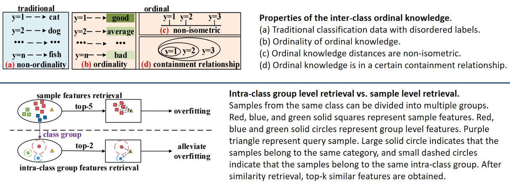
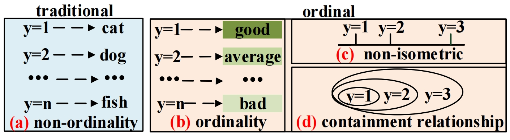
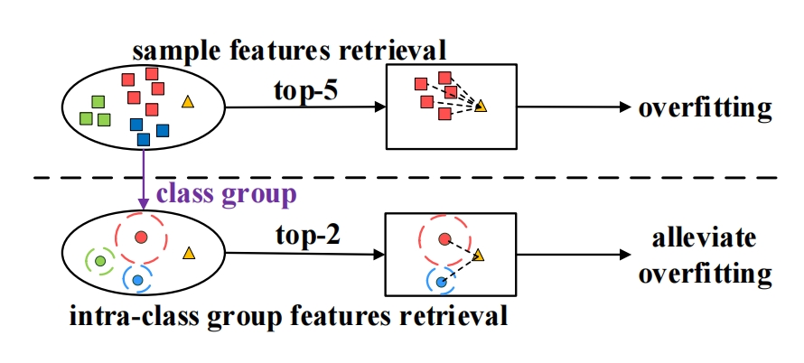
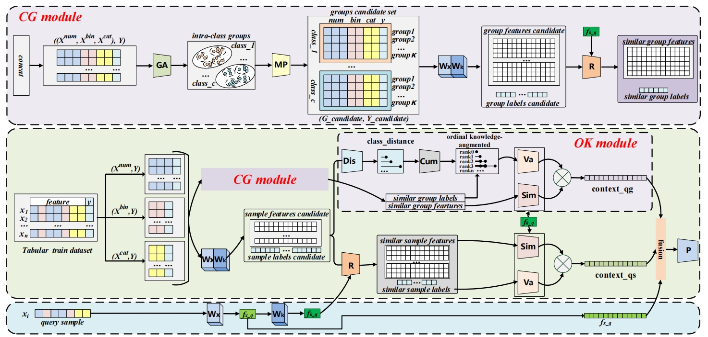

TabCGOK: Intra-Class Groups Retrieval and Inter-Class Ordinal Knowledge Augmented Network for Ordinal Tabular Data Prediction（2024 ECAI）

## Abstract
Ordinal tabular data, with advantages of structured knowledge representation in tabular data and the characteristic of inter-class ranks, has drawn increasing attention. However, existing retrieval-based tabular deep learning methods designed primarily for classical tabular data pay less attention to ordinal tabular data. Ordinal knowledge of ordinal tabular data provides a more explicit objective for tabular ordinal classification by considering both classification and regression properties. Furthermore, these approaches overlook the significance of intra-class group features which can balance the retrieved probability of various sample size groups and capture shared knowledge among multiple samples within same group. In this work, we propose the Intra-Class Groups Retrieval and Inter-Class Ordinal Knowledge Augmented Network (TabCGOK) model for ordinal tabular data prediction, equipped with Intra-Class Groups Retrieval (CG) module and Inter-Class Ordinal Knowledge Augmented (OK) module. The CG module provides intra-class group features candidate set for subsequent retrieval operation. It divides each class into several groups, then extracts the representation of each group as intra-class group features. And the intra-class group features candidate set consists of all intra-class group features from each class. The OK module is designed to capture inter-class ordinal knowledge. It estimates the ordinal distances by calculating inter-class feature distances, which could correspond to the inter-class non-isometric nature of ordinal knowledge, and then aggregates the previous ordinal distances to clarify the containment relationship of ordinal knowledge. OK module utilizes the attention mechanism for fusing the captured ordinal knowledge to retrieved intra-class group features. Finally, TabCGOK integrates fused intra-class group features with sample level features for ordinal tabular data prediction. Extensive experiments on several ordinal tabular datasets demonstrate the effectiveness of our method.

## TabCGOK motivation

<!-- -->
## TabCGOK Framework

Framework of our approach. TabCGOK retrieves group-level similar features (CG) and fuses them with inter-class ordinal knowledge augmentation weights (OK) to obtain similar group-level contextual features, which are then fused with sample-level similar features and sample features to obtain the final feature representation. $GA$ denotes group algorithm, $MP$ denotes mean-pooling, $W_x$ and $W_k$ denote the encoder, $R$ denotes the retriever, $Dis$ denotes the distance algorithm, Cum denotes the cumulative algorithm, $Va$ denotes the value algorithm, $Sim$ denotes the similarity algorithm, $P$ denotes the predictor, and $x_i$ denotes query sample which is a validation or test sample instance.
### Dataset 
The original datasets urls are in paper. We download them, then updown them at https://drive.google.com/file/d/1N3uxh5iL8VA60zgzaFAUT6zsZ6Pkk6xh/view?usp=drive_link .
The pre-processed datasets are in https://drive.google.com/drive/folders/1dB4SWJEAfmcQjzEU4Cit5eXNGpz9ZsUg?usp=drive_link .
